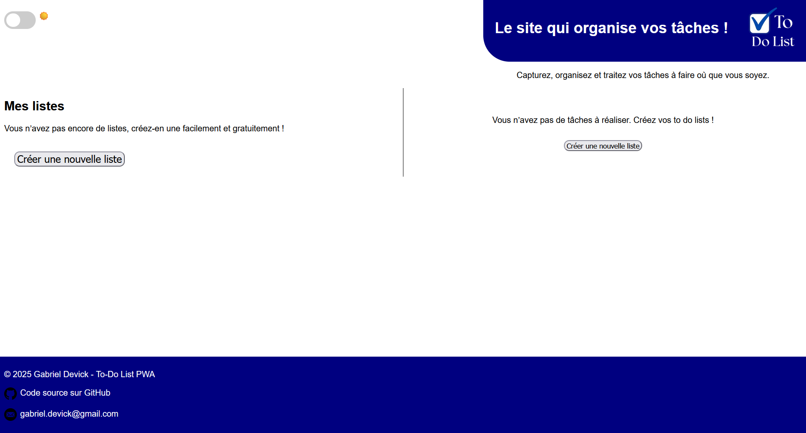

# ✅ TDL | To‑Do List PWA

> Une application web installable, simple et rapide, développée pendant l’été 2025 pour gérer mes tâches au quotidien, même hors-ligne.

**TDL** est une to-do list moderne en tant que **Progressive Web App (PWA)** : rapide, responsive, installable sur mobile/desktop, et fonctionnelle même sans connexion.

---

## ✨ Fonctionnalités

- 📝 Ajouter, supprimer, cocher des tâches
- 📦 Stockage local (aucune base de données requise)
- 📲 Installable sur mobile ou ordinateur
- 🔌 Utilisable hors-ligne grâce à un service worker
- 🎨 Interface responsive, épurée et fluide
- ☀️ Mode clair ou mode sombre

---

## 📸 Aperçu

---

## 🚀 Démo

👉 [Accéder à la version en ligne](https://gabdvck.github.io/to-do_list_web/)

> Compatible avec tous les navigateurs modernes (Chrome, Firefox, Edge, etc.)

---

## 🛠️ Technologies utilisées

- HTML5 / CSS3 / JavaScript (vanilla)
- Service Worker API (offline)
- Web App Manifest
- [localStorage](https://developer.mozilla.org/fr/docs/Web/API/Window/localStorage)

---

## 📦 Installation locale

1. Cloner le dépôt :

bash:
git clone https://github.com/gabdvck/to-do_list_web.git
cd to-do_list_web

2. Ouvrir index.html dans un navigateur

---

## 📂 Fonctionnement hors-ligne

- Le service worker met en cache les fichiers clés (index.html, JS, CSS, icons, etc.)
- Les données (tâches) sont stockées localement dans le navigateur via localStorage
- L'app continue à fonctionner sans connexion Internet

---

## 👤 Auteur

Développé librement par Gabriel Devick durant l’été 2025, par envie d’explorer les technologies web modernes.
Aucune dépendance externe, 100% vanilla JS

---

## 📄 Licence

Ce projet est distribué sous licence MIT – libre d’usage, de modification et de distribution.